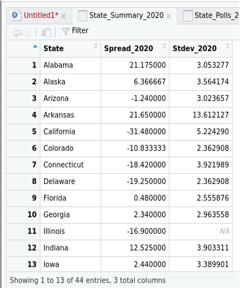
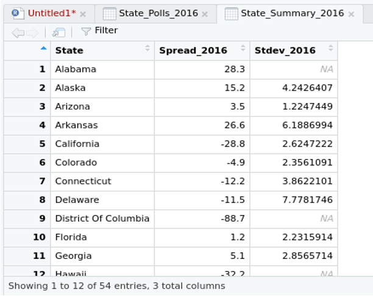
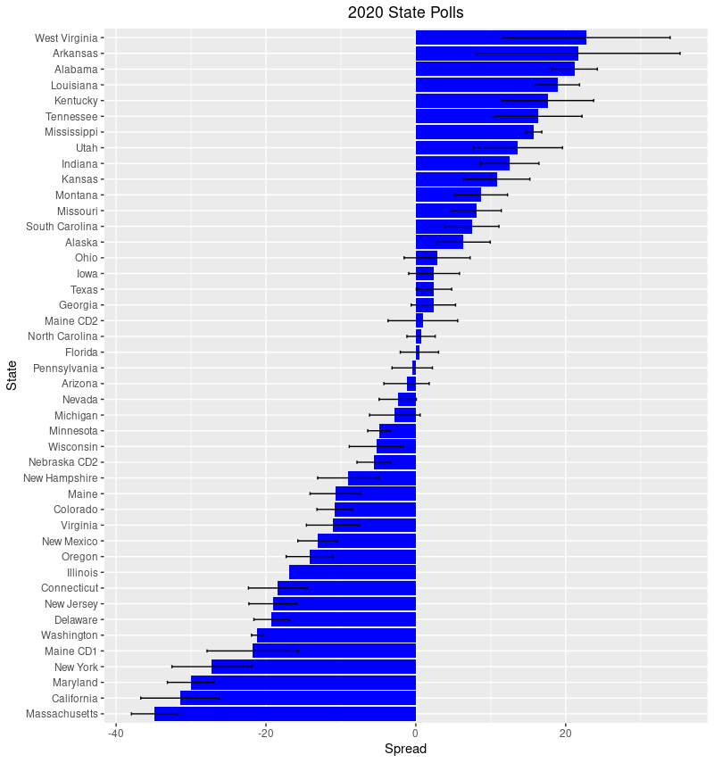
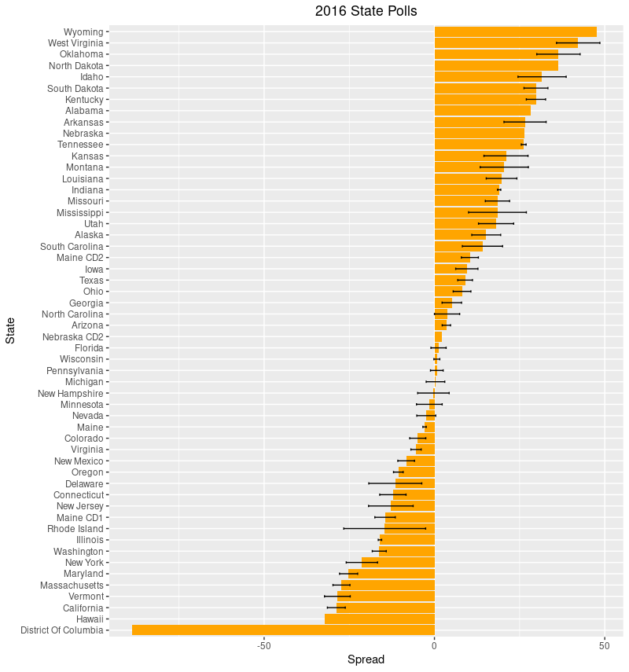
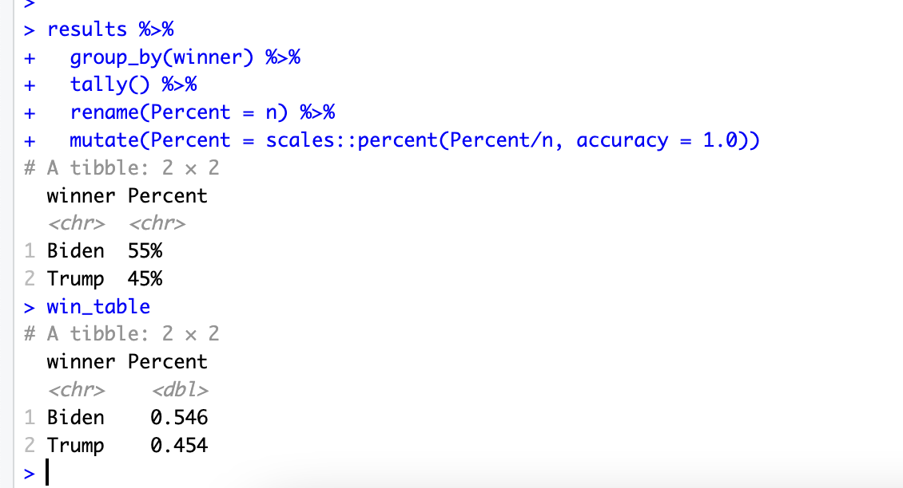
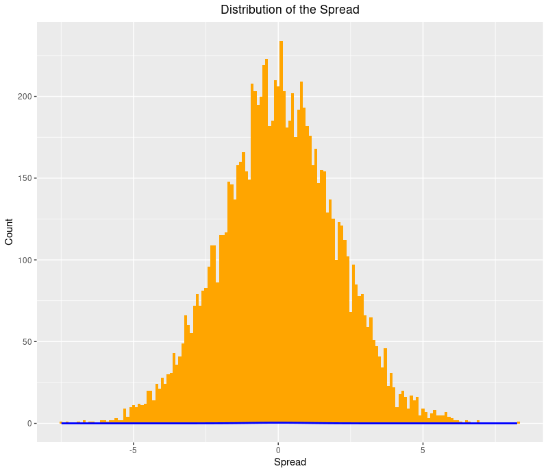
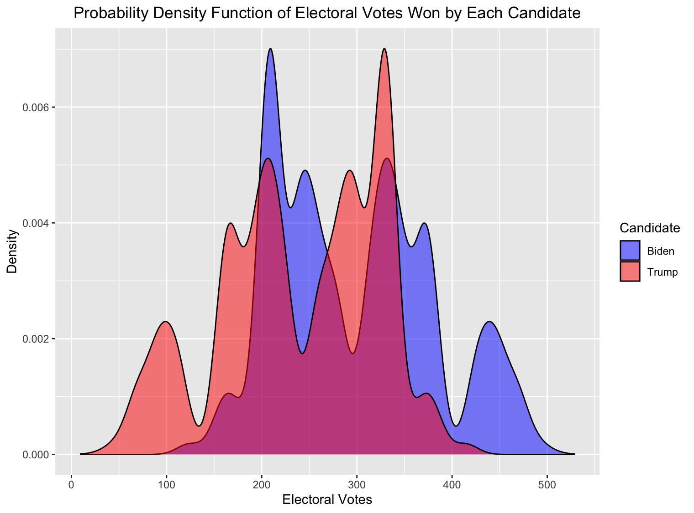

# Predicting Trump vs Biden 2020 Presidential Election Results using Markov Chain Monte Carlo (MCMC)

In this project, the goal is to make a Monte Carlo Markov Chain (MCMC) model to predict the 2020 presidential election.

## Overview

This project aims to predict the outcome of the 2020 U.S. Presidential Election between Donald Trump and Joe Biden using Markov Chain Monte Carlo (MCMC) methodology. The goal is to estimate the probability distribution of vote shares for each candidate and predict the election results based on state-by-state polling data.

## Project Structure

This repository contains the following files:

- `PresidentialElectionPredictionMCMC.R`: R code to generate the election prediction results.
- `data_files`: Contains the downloaded webpages needed for scrapping the polls tables.
- `README.md`: Instructions to run the code correctly.
- `output_images`: Contains the visualizations generated in the R code.

## Goal

The primary research question is: How well can an MCMC simulation model predict the outcome of a presidential election based on historical polling data, and what factors contribute to the accuracy of the predictions? The research question revolves around estimating the probability distribution of vote shares for each candidate and ultimately predicting the election results based on state-by-state polling data.

## Data Exploration

The dataset for this analysis was obtained by scraping state polling data from RealClearPolitics for both the 2020 and 2016 elections. The data includes electoral votes for each state and polling information. To build this model, first we focus on writing a dynamic scraping program that pulls in all of the current state polling data from RealClearPolitics. Then we use the state polling data to simulate 10,000 elections.

### Data Sources

- [RealClearPolitics 2020 Electoral College Map](https://www.realclearpolitics.com/epolls/2020/president/2020_elections_electoral_college_map.html)
- [RealClearPolitics 2016 Electoral College Map](https://www.realclearpolitics.com/epolls/2016/president/2016_elections_electoral_college_map.html)

### Initial Data Exploration

Initial data exploration involved examining the spread of polling data, calculating polling biases for 2020 and 2016, and preparing the dataset for the MCMC simulation.

1. The first step is to use use the 2020 and 2016 national data to calculate the polling bias in 2020 and 2016, respectively.

.

2) Using the above states summaries for 2020 and 2016, we can see that the spread for each of the state to be -

.

3) We’ll build the forecast model. Many of the states do not have polling yet. To deal with this we’re going to supplement the 2020 polls with the 2016 actual results. To try to get a better estimate of where these states may actually be polling we’ll apply an adjustment to the 2016 actual results based on the 2020 national polling.

4) Now we run the Monte Carlo simulation for n = 10000 times and get our final hyperparameters. The variable n will hold the number of trials we want to run. I’ve set it to 10,000 which should be more than enough.

5) dist_multiplier values represent how many standard deviations each trial will be from the mean.
In the above screen shot, the first trial has a standard deviation of -1.362. Since the number is positive, this means that Biden outperformed in this trial. For each state, we’ll add a -1.362 standard deviation move in Biden direction to the spread.

## Method & Algorithm

The chosen analytical method for this project is the Markov Chain Monte Carlo (MCMC) methodology. MCMC is a statistical technique that involves generating a sequence of samples from the target probability distribution. In the context of election prediction, it provides a flexible framework for estimating the probability distribution of vote shares for candidates.

### Model Formulation

1. **Prior Distribution**: Represented as P(θ), where θ denotes the vector of parameters associated with the model.
2. **Likelihood Function**: Represented as P(D|θ). The likelihood function is defined by its parameters such as the mean (μ) and variance (σ²).
3. **Posterior Distribution**: Represented as P(θ|D), which is proportional to the product of the prior distribution and the likelihood function.
4. **Proposal Distribution**: Generates candidate parameter values.
5. **Simulation**: Generate a sequence of 10,000 samples from the posterior distribution using MCMC algorithms.

### Self-Written Algorithm

The algorithm for predicting the election results using MCMC was implemented in R. Using the formulas, we'll do the following to predict the elections:\
1. The prior distribution can be represented as P($\theta$), where $\theta$ denotes the vector of parameters associated with the model. It is defined by its parameters such as the mean ($\mu$) and variance ($\sigma$^2^). For Trump ($\mu$~1~, $\sigma$~1~^2^ and for Biden ($\mu$~2~, $\sigma$~2~^2^)\
2. The likelihood function can be represented as P(D\|$\theta$). It is is defined by its parameters such as the mean ($\mu$) and variance ($\sigma$^2^)\
P(D\|$\theta$) = $\pi$ [N(d~i~ \| $\mu$~i~, $\sigma$~i~^2^)].\
where D is the observed data (i.e., state polling data), $\theta$ is the vector of parameters that includes the mean ($\mu$) and variance ($\sigma$^2^), and N denotes the normal distribution. The subscript i represents each state in the election, and d~i~ represents the observed vote share in state i.\
3. The posterior distribution can be represented as P($\theta$\|D) which is proportional to the product of the prior distribution and the likelihood function:\
P($\theta$\|D) $\propto$ P($\theta$) x P(D\|$\theta$)\
4. Define a proposal distribution that generates candidate parameter values.\
5. Simulate the Markov chain, generating a sequence of 10,000 samples from the posterior distribution using MCMC algorithms.\
6. After running the model for a sufficient number of iterations to ensure convergence and mixing, we can use the samples to estimate the probability of each candidate (Trump or Biden) winning the 2020 election.

### Results and Visualizations

The Monte Carlo simulation indicated that Biden was the favorite to win the election with a 55% chance. The final prediction model gave Biden a 54.6% probability of winning, while Trump had a 45.4% probability.

## Conclusion

The MCMC model accurately predicted the outcome of the 2020 Presidential Election, with Biden winning. The model's forecast relied on historical relationships governing voter behavior and pollster accuracy. The findings align with the actual election results, demonstrating the effectiveness of the MCMC methodology in predicting complex and uncertain political outcomes.

## References

1. Bayesian Data Analysis SECOND EDITION by Andrew Gelman, John B. Carlin, Hal S. Stern, and Donald B. Rubin; CHAPMAN & HALL/CRC Publication.
2. Certin N, Bentli I (2013) Application of Markov Process to forecast elections outcomes by computer simulation, Epoka conference systems, First international conference on management and economics, pp 104–110.

## Appendix

### R Code

All R code used in this project is included in the `PresidentialElectionPredictionMCMC.R` file. It covers the following:

- Data scraping
- Model setup
- Monte Carlo simulation
- Result visualization

### Validation

To ensure the correctness of the algorithm, the simulation was run for a small number of iterations to check intermediate results. Comparing the simulated results with actual election results from 2020 further validated the model. Regular validation against known data points and adjusting the algorithm parameters based on real-world outcomes contributed to refining the model and ensuring its reliability.

